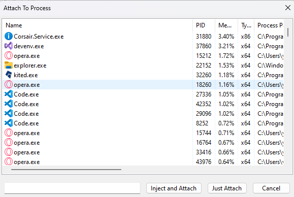
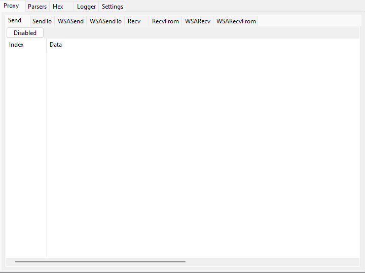

# Getting Started

Welcome to Packet Ripper! This introduction document is meant to quickly guide you over some of the most common uses of Packet Ripper. If you're interested in more detailed information, check out the  [User Guide](https://docs.packetripper.live/user-guide).

## Installing Packet Ripper[¶](https://docs.packetripper.live/getting-started.html#installing-Packet-Ripper "Permanent link")

The download links you receive after purchasing expire after 72 hours but as long as you have  [active support](https://packetripper.live/faq)  you can  [request download links](https://packetripper.live/recover/)  any time.

To install on Windows, use the installer linked from the email you received after purchase. During the install process, you'll need to choose whether to install globally or to your local user path.

## License[¶](https://docs.packetripper.live/getting-started.html#license "Permanent link")

When you first run Packet Ripper, it will prompt you for your license key. You should have received your license key via the same email that included your download links. If not, please contact  [support](https://packetripper.live/support).

## Attaching[¶](https://docs.packetripper.live/getting-started.html#attaching "Permanent link")

While there are more ways than shown here, the most common ways to open a file are:

-   Attach and Inject ( Use the built-in injector)
-   Just Attach (To use your own personal Injector)
-   Proxy (Coming Soon)

You can change [injection settings](/user-guide/injector) for bypassing detection mechanism

## UI Basics[¶](https://docs.packetripper.live/getting-started.html#ui-basics "Permanent link")

By default, you'll see four main areas in Packet Ripper:

1.  [Proxy](/user-guide/proxy) (With multiple types of Winsock packet logging)
2.  [Parser](/user-guide/perser) (To parse packets show in proxy)
3.  [Hex Editor](/user-guide/hex-editor) (To dynamically edit packets and resend them)
4.  [Logger](/user-guide/logger) (Shows the logs of both Packet Ripper and the Target process)

Make sure to check out the many configuration for the above in the settings menu.

## Updates[¶](https://docs.packetripper.live/getting-started.html#updates "Permanent link")

By default, Packet Ripper is configured to automatically update itself to any new stable releases. However, during changes to the update system, we will send updates trough an email download link.

## What's next?[¶](https://docs.packetripper.live/getting-started.html#whats-next "Permanent link")

-   Read the rest of the more detailed  [User Guide](user-guide.html)
-   Join one of our  [Slack](https://join.slack.com/t/packetripper/shared_invite/zt-2c50lxf5t-l8tetkIoTUYnEd9I2Lr86Q)
- Check out the [FAQ](https://packetripper.live/faq)
- [Contact us](https://packetripper.live/support) regarding questions, we are here to help
